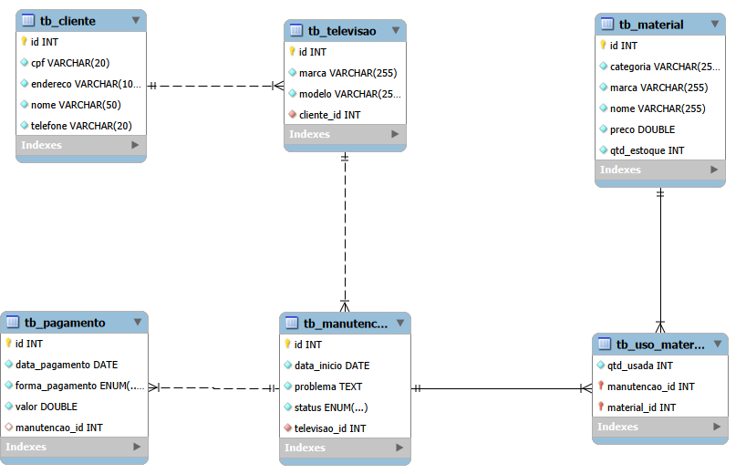
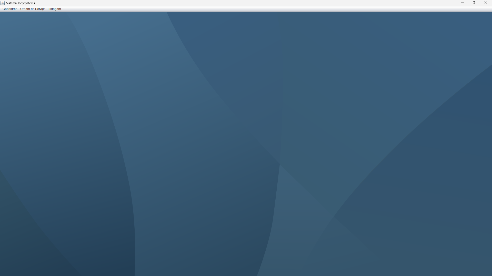
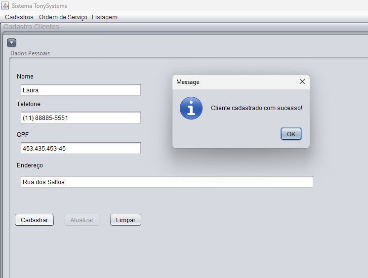
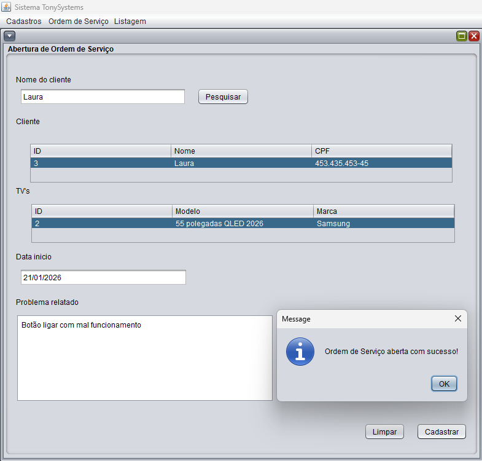

# 📺 TonySystems - Gestão de Assistência Técnica

> **Projeto curricular desenvolvido no SENAC**

## 🎯 Objetivo do Software
O **TonySystems** foi idealizado para modernizar o fluxo de trabalho de assistências técnicas especializadas no conserto de televisores. O sistema substitui registros manuais por uma plataforma digital que integra o controle de ordens de serviço, a gestão de peças em estoque e o fechamento financeiro, garantindo maior rastreabilidade e eficiência operacional.


---


## 🛠️ Tecnologias Aplicadas
O projeto utiliza tecnologias avançadas de persistência e mapeamento, focando em robustez e escalabilidade:

* **Linguagem:** Java (JDK 17 ou superior)
* **Interface Gráfica:** Java Swing (Biblioteca AWT/Swing)
* **Gerenciador de Dependências:** Maven
* **Banco de Dados:** MySQL
* **ORM (Mapeamento Objeto-Relacional):** **JPA (Java Persistence API) & Hibernate**
* **Conectividade:** JDBC (Java Database Connectivity)
* **Padrão de Arquitetura:** DAO (Data Access Object)


---


## 🏗️ Arquitetura do Projeto

O projeto foi estruturado seguindo o padrão DAO (Data Access Object), separando as responsabilidades em camadas para facilitar manutenção e escalabilidade.

```text
tonysystems/
├── dao/
│   └── Operações de acesso ao banco de dados
├── gui/
│   └── Interfaces gráficas Swing
├── model/
│   └── Entidades JPA / Classes de modelo
└── util/
    └── Classes auxiliares
```

---


## ✨ Funcionalidades do Sistema (Requisitos)
O sistema foi projetado para atender aos seguintes requisitos funcionais:

* **Cadastro de Clientes:** Registro e consulta de dados para contato e faturamento.
* **Inventário de Materiais:** Cadastro de componentes técnicos (capacitores, placas, resistores) com controle de preço unitário.
* **Gestão de Ordens de Serviço (OS):** Abertura de chamados vinculados a clientes e aparelhos específicos.
* **Baixa Automatizada de Estoque:** Validação de disponibilidade e subtração automática de peças do inventário no ato da finalização do serviço via JPA.
* **Módulo Financeiro:** Cálculo automático do valor total da manutenção e registro da forma de pagamento (Pix, Cartão ou Dinheiro).
* **Histórico de Manutenção:** Registro detalhado de quais materiais foram aplicados em cada televisor.


---


## 🔄 Fluxo Principal do Sistema


1. Cadastro do cliente
2. Cadastro da televisão
3. Abertura da ordem de serviço
4. Adição dos materiais utilizados
5. Registro do pagamento
6. Finalização da manutenção
7. Atualização automática do estoque


---


## 🧠 Conceitos Aplicados


- Programação Orientada a Objetos (POO)
- DAO Pattern
- JPA/Hibernate
- Relacionamentos OneToOne, OneToMany e ManyToMany
- Collections Framework (HashMap)
- Persistência de Dados
- Tratamento de Exceções
- Maven


---


## 🗄️ Modelo de Banco de Dados


O sistema foi modelado utilizando banco de dados relacional MySQL, com relacionamentos entre clientes, televisões, manutenções, materiais e pagamentos.



### Principais Relacionamentos

- Cliente → Televisão (1:N)
- Televisão → Manutenção (1:N)
- Manutenção → Pagamento (1:1)
- Manutenção → Material (N:N)
- Destaque para entidade associativa (tb_uso_material) para resolver um relacionamento muitos-para-muitos.


---


## 📸 Imagens do Sistema

### Tela Principal



### Cadastro Clientes



### Abertura Ordem de Serviço




---


## 📊 Status do Projeto
🚀 **Em Desenvolvimento**

* **Fases concluídas:** Modelagem de Banco de Dados, Implementação do JPA/Hibernate, CRUDs básicos, Lógica de agrupamento de consumo (`HashMap`).


---

## 👥 Time de Desenvolvedores
* **Jhonatan Oliveira** 

---

## 💡 Como executar o projeto

1.  **Clone o repositório:**
    ```bash
    git clone [https://github.com/seu-usuario/tonysystems.git](https://github.com/seu-usuario/tonysystems.git)
    ```
2.  **Importe o projeto** na sua IDE (NetBeans/IntelliJ) como um projeto **Maven**.
3.  **Configure o `persistence.xml`:** Ajuste as credenciais do seu MySQL no arquivo de configuração do JPA.
4.  **Execute o projeto:** O Hibernate cuidará da criação/validação das tabelas conforme a configuração do seu `persistence.xml`.
